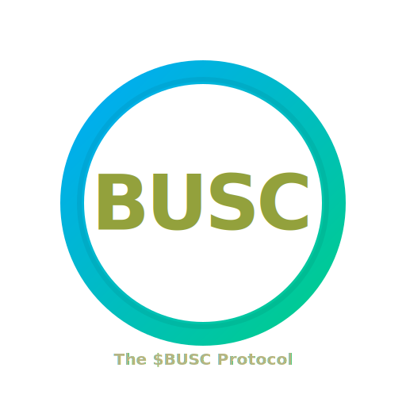

<div align="center">
  

# 🏦 The BUSC Stablecoin Protocol

**Minimal Overcollateralized Stablecoin (BUSC)**  
Built with [Solidity](https://soliditylang.org/) • Powered by [Foundry](https://getfoundry.sh)

[](https://github.com/wasim007choudhary/BUSC-StableCoin-Protocol/stargazers)
[](https://github.com/wasim007choudhary/BUSC-StableCoin-Protocol/network/members)
[](https://github.com/wasim007choudhary/BUSC-StableCoin-Protocol/issues)

[](https://soliditylang.org/)
[](./LICENSE)
[](https://getfoundry.sh)

</div>

---

## ⚙️ Installation

> Requires [Foundry](https://getfoundry.sh) to be installed.

```bash
# Clone the repository
git clone https://github.com/wasim007choudhary/BUSC-StableCoin-Protocol.git

# Enter project directory
cd BUSC-StableCoin-Protocol

# Install dependencies
forge install

# Build the project
forge build
```

---

## 🧪 Testing

#### Run all tests -> `forge test -vvvv`

#### Run fuzz tests -> `forge test --fuzz-runs 1000`

#### Generate coverage report -> `forge coverage --report lcov`

#### For coverage based testing: `forge coverage --report debug`

---

## ⚡ Deployment & Helpfull Commands

The project comes with a `Makefile` that automates common tasks such as build, deploy, test, and coverage.

### 📝 Environment Setup

Create a `.env` file in the project root and add the following variables:

```env
For local Anvil network
ANVIL_RPC_URL=http://localhost:8545
ANVIL_PRIVATE_KEY=<your-local-anvil-private-key>

# For Sepolia testnet
SEPOLIA_RPC_URL=<your-sepolia-rpc-url>
SEPOLIA_PRIVATE_KEY=<your-sepolia-wallet-private-key>
ETHERSCAN_API_KEY=<your-etherscan-api-key>
```

### 🚀 Deploy Contracts

# Deploy to local Anvil network

`make deploy-anvil`

---

# Deploy to Sepolia testnet (with verification on Etherscan)

`make deploy-sepolia`

---

### 🛠 Other Useful Make Commands

Use the provided Makefile to simplify your workflow:

### Clean build artifacts and remove gitmodules/lib

`make clean`
`make remove`

### Install or update dependencies

`make install`
`make update`

### Compile contracts

`make build`

### Start local anvil chain (with deterministic keys)

`make anvil`

## 📖 Overview

**BUSC** (Blockchain USD Coin) is a decentralized stablecoin designed to maintain a **1:1 peg with the US Dollar**, backed by exogenous collateral (**WETH & WBTC**).  
The protocol is implemented through the **BUSCmotor** contract, which serves as the **backbone** of the system — handling collateral deposits, minting & burning BUSC, redemptions, and liquidations.

This design draws inspiration from **MakerDAO’s DSS architecture** while simplifying governance, fees, and collateral types.

This repo contains the **core BUSC ERC20**, **motor logic**, **deployment scripts**, **oracle libraries**, and a **robust Foundry test suite**.

---

## ✨ Key Features

- **Exogenously Collateralized** — BUSC is always backed by external crypto assets (WETH, WBTC).
- **Perpetually Overcollateralized** — Collateral value > BUSC supply at all times.
- **No Governance / No Fees** — Minimalistic and trust-minimized design.
- **Automatic Liquidations** — Keeps the system solvent when health factors drop.
- **1:1 USD Peg** — Achieved via minting, redemption, and liquidation mechanisms.
- **Atomic Utilities** — Combined functions (e.g., deposit & mint, burn & redeem) for better UX.
- **ERC20MockDecimal** — Added for **local testing**, enabling WBTC simulation with **8 decimals** via helper config.
- **Custom OracleLib** — Ensures **price freshness**; if Chainlink price feeds are stale, the protocol **freezes** until valid data is restored.

---

## 📊 Project Structure

```text
📂 BUSC-Stablecoin/
│
├── 📂 assets/                     # Logos & diagrams
├── 📂 cache/                      # Foundry build cache
├── 📂 coverage/                   # Coverage reports
├── 📂 lib/                        # External deps
├── 📂 out/                        # Build artifacts
├── 📂 script/                     # Deployment scripts
│   ├── 📜 DeployBUSC.s.sol
│   └── 📜 HelperConfig.s.sol
│
├── 📂 src/                         # Core protocol contracts
│   ├── 📜 BUSCmotor.sol
│   ├── 📜 BUSCstablecoin.sol
│   └── 📂 Oracle-lib/
│       └── 📜 OracleLib.sol
│
├── 📂 test/                        # Test suite
│   ├── 📂 fuzz-invariant/
│   │   ├── 📂 ContinueOnRevert/
│   │   │   ├── 📜 HandlerContinueOnRevert.t.sol
│   │   │   └── 📜 InvariantsContinueOnRevert.t.sol
│   │   └── 📂 FailOnRevert/
│   │       ├── 📜 HandlerFailOnRevert.t.sol
│   │       └── 📜 InvariantsFailOnRevert.t.sol
│   │
│   ├── 📂 Mocks/
│   │   ├── 📜 ERC20MockDecimals.sol
│   │   └── 📜 MockV3Aggregator.sol
│   │
│   └── 📂 Unit/
│       ├── 📜 BUSC-Stablecoin.t.sol
│       └── 📜 BUSCmotor.t.sol
│
├── 📜 foundry.toml               # Foundry config
└── 📜 README.md                  # Project docs
```

### **Core Contracts**

- **[`BUSCstablecoin.sol`](./src/BUSCstablecoin.sol)** → ERC20 token contract for BUSC.
- **[`BUSCmotor.sol`](./src/BUSCmotor.sol)** → Protocol logic: collateral management, minting, burning, liquidation,redeeming and other Internal main logics.
- **[`ERC20MockDecimal.sol`](./src/mocks/ERC20MockDecimal.sol)** → Local testing helper for tokens with custom decimals (e.g., WBTC 8 decimals).
- **[`OracleLib.sol`](./src/libraries/OracleLib.sol)** → Custom library wrapping Chainlink feeds to handle **stale prices**.

### **Supported Collaterals**

- **WETH (Wrapped Ether)**
- **WBTC (Wrapped Bitcoin)**

### **External Integrations**

- **Chainlink Oracles** for reliable USD price feeds.
- **OpenZeppelin ReentrancyGuard & ERC20 standards** for security.

---

## 📊 Risk Parameters

- **Collateralization Ratio:** 200%
- **Liquidation Threshold:** 50%
- **Liquidation Bonus:** 10%
- **Minimum Health Factor:** `1e18` (must stay ≥ 1 to avoid liquidation)
- **Oracle Staleness Protection:** Protocol freezes if Chainlink price feed is stale.

---

## 🧪 Testing Utilities

- **ERC20MockDecimal** → enables **WBTC simulation (8 decimals)** in local tests via `HelperConfig`.
- **OracleLib** → simulates stale price conditions and validates protocol freeze mechanism.

---

## 🔒 Security Considerations

- Protocol is designed to always stay overcollateralized.

- Uses CEI pattern and ReentrancyGuard for security.

- Collateral supported is strictly limited to WETH & WBTC.

- Relies on Chainlink Oracles with custom staleness checks.

---

## 🤝 Contributing

- PRs and issues are welcome! Please:

- Add/extend tests for new features.

- Ensure forge fmt && forge test -vvv passes.

- Run fuzzing (forge test --fuzz-runs 1000) before merging.

---

## 👨‍💻 Author

`Wasim Choudhary`

Builder of minimalistic, trustless financial primitives on Ethereum.

---

## 📜 License

This project is licensed under the MIT License.

MIT
© 2025 Wasim Choudhary
